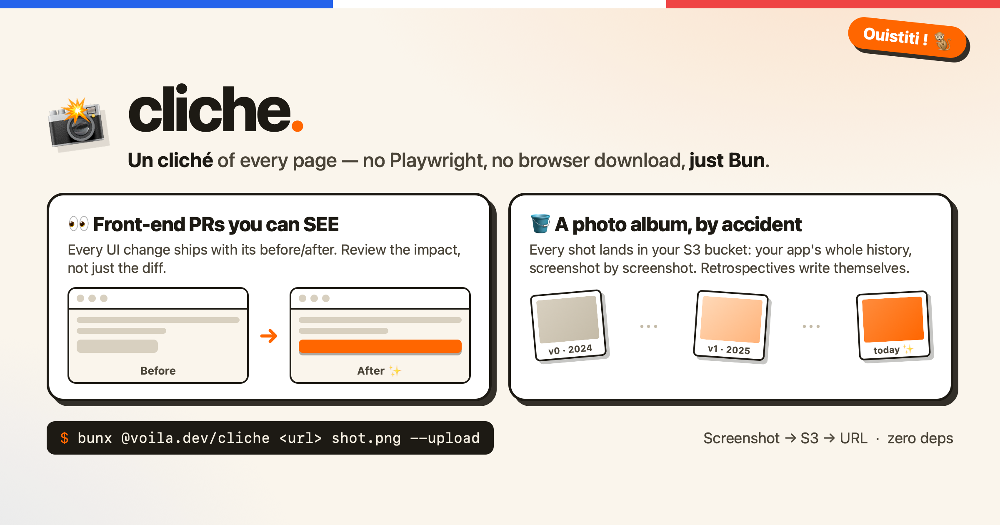

# cliche 📸

**Take a _cliché_ of any page and get a shareable URL.** No Playwright, no
browser download, no dependencies — just Bun. Ouistiti ! 🐒

> _Un cliché_ is French for a snapshot. This one screenshots your app with
> [`Bun.WebView`](https://bun.com/docs/runtime/webview), uploads it to any
> S3-compatible bucket with `Bun.S3Client`, and hands you the URL (or the
> markdown line) to paste into a pull request. **Everything runs on your
> machine** — the only thing that leaves it is the upload to *your* bucket.
>
> This very image was captured by cliche, from an HTML file, in one command.
> [cliche.voila.dev](https://cliche.voila.dev)

```sh
bunx @voila.dev/cliche https://localhost:4001/missions mission-list.png --upload --prefix pr-123
```

```
Captured https://localhost:4001/missions -> mission-list.png
Uploaded mission-list.png -> pr-123/2026-08-29-mission-list-d1cf773c.png
https://assets.example.com/pr-123/2026-08-29-mission-list-d1cf773c.png
```

The URL is yours to paste anywhere; add `--markdown` to get a ready-made
`` line for `gh pr edit --body` instead.

Or skip the CLI entirely and give the tools to your agent — `cliche` is also
a local MCP server:

```sh
claude mcp add cliche -- bunx @voila.dev/cliche mcp
```

## Why you want this

**1. Front-end PRs you can SEE.** A diff tells the reviewer what changed in
the code; a before/after tells them what changed *for the user*. When every
UI pull request ships with its pixels, review gets faster, regressions get
caught at a glance, and "looks good to me" actually means someone looked.

**2. You're building a photo album by accident.** Content-hashed keys mean
every shot stays in your bucket forever, dated and browsable. Six months in,
you own something no git history gives you: what your app *looked like*,
release by release. Retrospectives, launch recaps, "remember when the
dashboard looked like this?" — it's all just sitting in S3.

The usual capture path drags in a Playwright install, a 100MB browser
download, and a place to host the image. `cliche` is a single
zero-dependency CLI (and MCP server):

- **Capture** — `Bun.WebView`: the system WKWebView on macOS (nothing to
  install), your installed Chrome via CDP on Linux/Windows. Retina-crisp PNGs.
- **Upload** — `Bun.S3Client`: works with Cloudflare R2, AWS S3, MinIO,
  anything that speaks S3. Keys are content-hashed, so re-uploads never break
  old links.
- **URL out** — one public URL per file on stdout (progress on stderr), or
  `--markdown` for `` lines, so you can pipe it wherever the
  review happens.
- **MCP in** — `cliche mcp` serves the same two tools (`screenshot`, `upload`)
  over stdio to any MCP client, hand-rolled JSON-RPC, still zero dependencies.
  Everything runs locally.

Requires Bun ≥ 1.4.0.

## Capture

```sh
cliche <url> <out.png> [options]
```

| Option | What it does |
| --- | --- |
| `--viewport <WxH>` | Viewport, default `1440x900` (`390x844` for mobile shots). |
| `--wait-for <css>` | Hold the shot until a selector exists — SPAs render late. |
| `--scroll-to <css>` | Scroll a component into view before shooting. |
| `--settle <ms>` | Let fonts/images/animations finish, default `1500`. |
| `--local-storage k=v` | Seed the target origin's localStorage (repeatable). |

The `--local-storage` flag is the trick for authenticated screens: seed your
app's session token and the page boots logged in — no login form scripting.

```sh
cliche http://localhost:4001/admin dashboard.png \
  --local-storage "myapp.session-token=$TOKEN" \
  --wait-for '[data-testid=dashboard]'
```

## Upload

```sh
cliche upload [--prefix pr-123] [--markdown] *.png   # or add --upload to a capture
```

Configuration is the standard environment variables `Bun.S3Client` already
reads — if your shell can talk to your bucket, so can `cliche`:

| Variable | Example |
| --- | --- |
| `S3_BUCKET` | `assets-dev` |
| `S3_ENDPOINT` | `https://<account>.r2.cloudflarestorage.com` (R2) — omit for AWS |
| `S3_ACCESS_KEY_ID` / `S3_SECRET_ACCESS_KEY` | your keys (`AWS_*` works too) |
| `CLICHE_PUBLIC_URL` | `https://assets.example.com` — the bucket's public/custom domain |

Objects are keyed `<prefix>/<yyyy-mm-dd>-<name>-<content-hash>.<ext>`: the
hash makes re-uploads cache-safe, the date keeps the bucket browsable. The
caption is derived from the file name — name files like you want them read:
`mission-detail-after.png` → ``.

> [!WARNING]
> The bucket you point `cliche` at should be one you're happy to have public
> (PR descriptions live forever). Never capture real user data.

## MCP server

```sh
cliche mcp        # stdio; nothing leaves your machine except the S3 upload
```

Registers two tools with any MCP client:

- **`screenshot`** — `url` (required), `out`, `viewport` (`"390x844"`),
  `wait_for`, `scroll_to`, `settle_ms`, `local_storage` (object), `upload`,
  `prefix`, `markdown`. Without `out` the shot lands in a temp file; with
  `upload: true` the result is the public URL.
- **`upload`** — `files` (required), `prefix`, `markdown`.

One-liners:

```sh
claude mcp add cliche -- bunx @voila.dev/cliche mcp    # Claude Code
```

or in a project's `.mcp.json`:

```json
{
  "mcpServers": {
    "cliche": { "command": "bunx", "args": ["@voila.dev/cliche", "mcp"] }
  }
}
```

## Programmatic API

```ts
import { capture, upload } from "@voila.dev/cliche";

await capture({
  url: "http://localhost:3000",
  out: "home.png",
  viewport: { width: 390, height: 844 },
  waitFor: "main",
});

const [shot] = await upload({ files: ["home.png"], prefix: "pr-7" });
console.log(shot.markdown);
```

## Claude Code skill

`skill/SKILL.md` in this package is a ready-made
[Claude Code](https://claude.com/claude-code) skill: copy it to
`.claude/skills/pr-screenshots/` in your repo and Claude captures, uploads,
and embeds before/after screenshots whenever a PR touches something visible.

```sh
mkdir -p .claude/skills/pr-screenshots
cp node_modules/@voila.dev/cliche/skill/SKILL.md .claude/skills/pr-screenshots/
```

## Platform notes

- **macOS** — WKWebView, zero setup. Shots come out at the display's scale
  factor (2x on retina).
- **Linux / Windows** — drives an installed Chrome, Chromium, Edge or Brave
  over the Chrome DevTools Protocol (GitHub Actions runners ship Chrome, so
  CI capture works out of the box).
- `Bun.WebView` is marked experimental by Bun; `cliche` pins none of its
  sharp edges and will track the API as it settles.

## License

MIT
